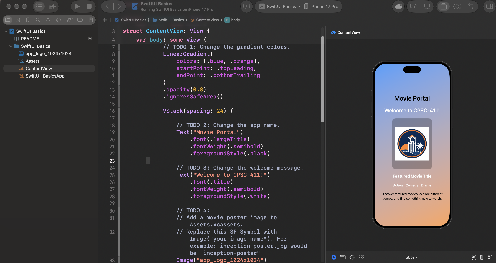
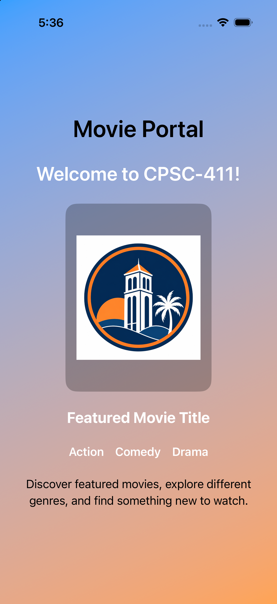
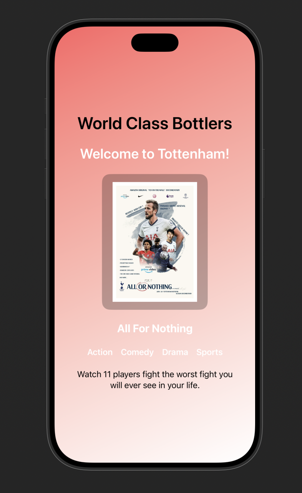

# CPSC 411 — Lab 01: SwiftUI Basics

## Goal

In this lab, you will clone a SwiftUI project, open it in Xcode, run it in the iOS Simulator, make simple UI changes, and push your work back to GitHub.

## 1. Clone the Repository

Open the Lab 01 repository:

https://github.com/csuf-cpsc-411-fa26/CPSC411-Lab-01

Using GitHub Desktop:

1. Click **Code → Open with GitHub Desktop**.
2. Choose a local folder.
3. Click **Clone**.

Or using Terminal:

```bash
git clone https://github.com/csuf-cpsc-411-fa26/CPSC411-Lab-01.git
```

## 2. Open and Run

Open:

```text
SwiftUI Basics.xcodeproj
```

Then:

1. Select an iPhone simulator.
2. Open `ContentView.swift`.
3. Run with **Command + R**.

To show the SwiftUI Preview:

```text
Option + Command + Return
```
XCode UI:


## 3. Complete the TODOs

Modify `ContentView.swift` to:

* Change the gradient colors.
* Change the app name.
* Change the welcome message.
* Add your own movie poster.
* Change the featured movie title.
* Add one additional genre.
* Replace the description with your own 1–2 sentence description.

### Add a Movie Poster

1. Open **Assets** in Xcode.
2. Drag in a `.jpg` or `.png` image.
3. Give the asset a simple name such as `movie-poster`.
4. Replace:

```swift
Image(systemName: "movieclapper")
```

with:

```swift
Image("movie-poster")
```

## 4. Add a Screenshot

Run your completed app and take a screenshot.

Save it as:

```text
screenshots/lab01-result.png
```

Then add:

```markdown
## Result


```

## 5. Commit and Push

Using GitHub Desktop:

1. Review your changes.
2. Commit with a message such as `Complete Lab 01`.
3. Click **Push origin**.

## Submission Checklist

* [ ] App runs in the iOS Simulator.
* [ ] Gradient colors changed.
* [ ] App name and welcome message changed.
* [ ] Movie poster added.
* [ ] Featured movie and genre updated.
* [ ] Description updated.
* [ ] Screenshot added.
* [ ] Changes committed and pushed.

## Submission

Submit your GitHub repository URL in Canvas.
